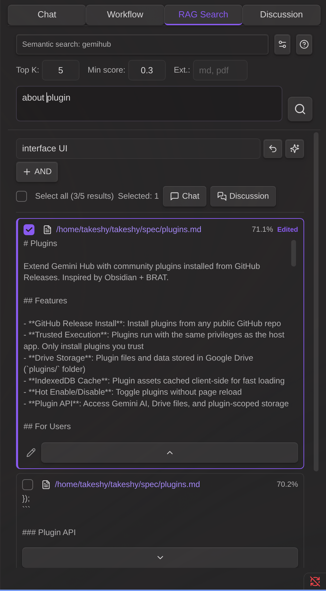

# Pesquisa RAG

A aba **Pesquisa RAG** oferece uma interface dedicada para pesquisa vetorial semântica, filtragem por palavras-chave, edição de chunks e envio de resultados para Chat ou Discussion.

## Pesquisa

1. Selecione uma **configuração RAG** no menu suspenso (cada configuração possui seu próprio índice, modelo de embedding e parâmetros)
2. Digite uma consulta e pressione Enter ou clique no botão de pesquisa
3. Ajuste o **Top K** (número máximo de resultados) e o **Score Threshold** (similaridade mínima) conforme necessário

Os resultados são classificados pela similaridade cosseno entre o embedding da consulta e cada chunk indexado.

## Filtro por palavra-chave

Após uma pesquisa semântica, use o filtro por palavra-chave no topo da lista de resultados para refinar os resultados. Múltiplos campos de filtro podem ser combinados para filtragem precisa.

- **Dentro de um campo** — Termos separados por espaços usam lógica **OR** (qualquer termo corresponde)
- **Entre campos** — Múltiplos campos usam lógica **AND** (todos os campos devem corresponder)
- Clique no botão **+ E** para adicionar um campo de filtro
- Clique em **✕** para remover um campo de filtro
- Pesquisa tanto no texto do trecho quanto no caminho do arquivo
- A caixa "Selecionar tudo" e a contagem refletem a visualização filtrada
- Limpe todos os filtros para ver todos os resultados novamente

### Sugestão de palavras-chave com IA

Cada campo de filtro tem um botão **✦** que usa IA para expandir suas palavras-chave com sinônimos e termos relacionados.

- Digite palavras-chave e clique em ✦
- O **Modelo de refinamento IA** configurado gera termos relacionados e substitui o conteúdo do campo
- Clique no botão **↩** (desfazer) para restaurar as palavras-chave originais
- Requer a seleção de um modelo em **Modelo de refinamento IA** (ícone de engrenagem das configurações de pesquisa)

Útil para capturar variações terminológicas que a busca por similaridade de embeddings pode ter perdido, enquanto filtra dentro dos resultados já recuperados.

## Seleção de resultados

- Clique em uma linha de resultado para alternar sua seleção
- Use a caixa de seleção **Selecionar tudo** para selecionar/desmarcar todos os resultados visíveis (filtrados)
- O contador **Selecionados** mostra quantos resultados estão selecionados em todos os resultados (não apenas na visualização filtrada)

## Envio de resultados para Chat ou Discussion

Selecione resultados com as caixas de seleção e clique em um dos botões:

- **Chat** — Os resultados são adicionados como anexos na área de entrada do Chat. O menu suspenso RAG do Chat é automaticamente definido como "none" para evitar injeção duplicada de contexto.
- **Discussion** — Os resultados são adicionados como anexos no painel Discussion e a aba muda para Discussion.

Resultados de texto tornam-se anexos de texto editáveis. Resultados de mídia (imagens, PDFs, áudio, vídeo) são anexados como arquivos binários.

**Edição no Chat:** Após enviar resultados para o Chat, anexos de texto com caminho de origem são clicáveis na área de entrada. Clique para abrir o conteúdo em um modal onde você pode revisar e editar antes de enviar.

## Edição de chunks

Clique no ícone de lápis (visível quando um resultado de texto está expandido) para abrir o modal do editor de chunks.

No editor você pode:

- **Editar o texto** — Modifique o conteúdo do chunk livremente. As alterações são salvas de volta na lista de resultados da pesquisa.
- **Carregar chunk anterior** — Clique em `▲ Load previous chunk` para adicionar no início o chunk anterior do mesmo arquivo. A sobreposição entre chunks é removida automaticamente.
- **Carregar próximo chunk** — Clique em `▼ Load next chunk` para adicionar ao final o próximo chunk do mesmo arquivo. A sobreposição é removida automaticamente.
- **Combinar e editar** — Após carregar chunks adjacentes, todo o texto pode ser editado como um único bloco. Salve para atualizar o resultado.

Isso é útil quando uma pesquisa semântica retorna um chunk ao qual falta contexto importante do texto ao redor.

## Refinar com IA

Clique em **✨ Refine with AI** no editor de chunks para expandir e limpar automaticamente o texto usando um LLM.

**Como funciona:**

1. **Expansão inicial** — Carrega até 3 chunks anteriores e 3 seguintes em paralelo
2. **Avaliação por IA** — O LLM avalia se o texto possui contexto suficiente para a consulta de pesquisa. Se mais contexto for necessário, carrega mais 3 chunks na direção indicada (até 5 iterações)
3. **Refinamento** — O LLM limpa o texto combinado: remove artefatos de fragmentação, frases cortadas e ruído, preservando todas as informações significativas. O resultado é transmitido em streaming para o editor.

**Configuração:** Selecione um modelo no menu suspenso **AI Refine Model** nas configurações de pesquisa (ícone de engrenagem). O botão fica desabilitado quando nenhum modelo está selecionado.

**Observações:**
- O botão é ocultado após o uso (operação única por sessão de edição)
- Os links para chunks anterior/próximo são ocultados durante e após o refinamento
- A área de texto é desabilitada durante o processamento para indicar atividade
- O idioma original do conteúdo é preservado

## Tratamento de resultados PDF

- **RAG interno** (indexado por este plugin): PDFs são anexados como chunks de páginas extraídas
- **RAG externo** (índice pré-construído com texto extraído): um menu suspenso por resultado permite escolher:
  - **Como texto** — Texto editável extraído do PDF
  - **Como chunk PDF** — Páginas PDF originais com pré-visualização inline

## Configurações do índice

Clique no ícone de engrenagem na barra de pesquisa para abrir a configuração do índice inline:

- **Chunk Size** — Caracteres por chunk
- **Chunk Overlap** — Sobreposição de caracteres entre chunks adjacentes
- **PDF Chunk Pages** — Número de páginas PDF por chunk de embedding (1–6)
- **Target Folders** — Limitar a indexação a pastas específicas (separadas por vírgula)
- **Exclude Patterns** — Padrões regex para excluir arquivos (um por linha)
- **Search File Extensions** — Limitar a pesquisa a tipos de arquivo específicos (separados por vírgula)
- **AI Refine Model** — Selecionar o modelo LLM usado para "Refine with AI" no editor de chunks (nenhum = desabilitado)
- Botão **Sync** com barra de progresso e registro de data/hora da última sincronização
- Lista de **arquivos indexados** com contagem de chunks por arquivo

## Como o RAG funciona em Chat vs. Pesquisa

| | Chat + menu suspenso RAG | Pesquisa → Seleção → Chat/Discussion |
|---|---|---|
| **Injeção de contexto** | Prompt do sistema (automático) | Anexos da mensagem do usuário |
| **Edição** | Não editável antes do envio | Clique nos anexos para editar no modal |
| **Parâmetros** | Usa os padrões da configuração RAG | Ajustável por pesquisa (Top K, limiar) |
| **Seleção de resultados** | Todos os resultados incluídos automaticamente | O usuário seleciona quais resultados incluir |
| **Chunks adjacentes** | Não disponível | Carregar chunks anterior/próximo no editor |
| **Filtro por palavra-chave** | Não disponível | Filtrar resultados antes de selecionar |
| **Refinamento IA** | Não disponível | Expandir chunks automaticamente e refinar com LLM |

O fluxo de pesquisa oferece mais controle sobre o contexto enviado ao LLM. O menu suspenso RAG do Chat é um atalho conveniente para injeção de contexto totalmente automática.

## RAG em Discussion

O painel Discussion suporta RAG de duas formas:

1. **Pesquisa → Discussion** — Selecione resultados na aba de Pesquisa e clique no botão Discussion. Os resultados são adicionados como anexos e podem ser editados antes de iniciar.
2. **Menu suspenso RAG** — Selecione uma configuração RAG diretamente no painel Discussion. O texto do tema é usado como consulta de pesquisa. Esta opção é desativada quando já existem anexos (da pesquisa ou upload de arquivo).

O contexto RAG e os anexos são enviados apenas no **primeiro turno** da discussão para evitar chamadas de API redundantes. Os turnos seguintes se baseiam no histórico da discussão, que já reflete o contexto RAG.
